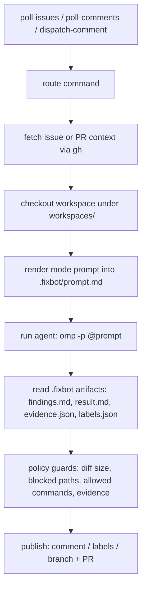

# agent-fixbot

A local GitHub bot runner that acts as a **normal GitHub user** (machine account + `gh` CLI). It polls issues and comments on a repository, routes `@bot` commands, prepares an isolated workspace, runs a coding agent (`omp`/`pi`) against a rendered prompt, and — when policy guards pass — publishes the result as a comment, labels, or a pull request.

No GitHub App, no webhooks required: everything runs from a host where the bot account is logged in via `gh auth login`.

## How it works



1. **Watch** — `daemon` (or cron-driven `poll-issues` / `poll-comments`) reads recently opened issues and recent comments. New issues get keyword-based auto labels; `@bot <command>` comments are routed once each.
2. **Prepare** — the target issue/PR context is fetched with `gh`, a clean checkout is created under `.workspaces/`, and a mode-specific prompt (see `src/features/prompts/templates/`) is written to `.fixbot/prompt.md`.
3. **Run** — the configured agent command (default `omp -p @{prompt}`) runs inside the workspace with a timeout. The agent never sees a GitHub token; all GitHub mutations go through the wrapper.
4. **Publish** — the wrapper reads the agent's artifacts (`.fixbot/findings.md`, `.fixbot/result.md`, `.fixbot/evidence.json`), enforces policy (max changed files, max diff lines, blocked paths, required evidence), then posts the findings comment, applies status labels, and opens a PR — only if `policy.allowPush` is `true`.

## Modes

| Mode | Target | Edits code | Output |
| --- | --- | --- | --- |
| `triage` | issue | no | status comment + `triaged` label |
| `reproduce` | issue | tests only | repro verdict + `fixbot:reproduced` / `fixbot:no-repro` |
| `fix` | issue | yes | findings comment + PR (`fixbot:pr-opened`) |
| `fix-ci` | issue/PR | yes | fix for failing checks, with PR check context |
| `review` | PR | no | review comment + `reviewed` label |
| `address-review` | PR | yes | pushes fixes back to the PR branch |

## Quickstart

```bash
pnpm install
pnpm build
node dist/cli.js doctor            # check gh, git, agent availability

# one-shot, no side effects
node dist/cli.js prepare owner/repo#123 --dry-run
node dist/cli.js fix owner/repo#123 --dry-run

# keep watching a repository until Ctrl+C
pnpm dev -- owner/repo --bot fixbot
```

Run `node dist/cli.js help` for the full command list (`prepare`, `reproduce`, `triage`, `review`, `fix`, `fix-ci`, `address-review`, `poll-issues`, `poll-comments`, `route-comment`, `dispatch-comment`, `stop`, `daemon`, `doctor`).

## Configuration

Optional `.fixbot.json` in the working directory; every field has a safe default (`src/features/config/config.ts`). See `.fixbot.example.json` for a complete example.

Key settings:

- `agent` — command, args (`@{prompt}` placeholder), and timeout for the coding agent.
- `autoLabel` — keyword rules applied to newly polled issues.
- `autoDispatch` — optionally start a `triage`/`reproduce`/`fix` job automatically for new issues.
- `policy` — the safety rail: `allowPush` (default **false**: dry-run PRs only), `maxChangedFiles`, `maxDiffLines`, `blockedPaths` (workflows, release scripts, `.env*`), `allowedCommands`, evidence requirements, and terminal status labels.

## Safety model

- The agent process runs without GitHub credentials; only the wrapper talks to GitHub through the bot account's `gh` CLI.
- Defaults are read-only: `policy.allowPush: false` means no real branch or PR is created until you opt in.
- Oversized or out-of-bounds patches (too many files, too many lines, blocked paths) are rejected before publishing.

## Further reading

- `docs/roboomp-operations.md` — full operations guide: bot account setup, `gh` auth, daemon scheduling, guard details (Turkish).
- `docs/roboomp-capability-audit.md` — capability comparison against a GitHub App based bot (Turkish).

## Development

```bash
pnpm typecheck
pnpm test        # builds, then runs node --test against dist/**/*.test.js
```
