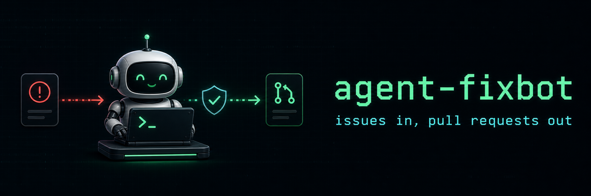

<div align="center">



# agent-fixbot

**Issues in, pull requests out.**

A local CLI runner that operates a normal GitHub **bot account** (no GitHub App) to triage, reproduce, and fix issues, and to review or repair pull requests.


[How it works](#how-it-works) · [Setup](#setup) · [Commands](#commands) · [Bot mentions](#bot-mentions) · [Configuration](#configuration) · [Safety model](#safety-model)

</div>

It polls a repository with the `gh` CLI, routes `@bot` mentions to commands, prepares an isolated workspace, runs a configured coding agent (`omp` by default) against a rendered prompt, and — only when every safety guard passes — publishes the result as a PR, comment, or label update.

The agent process never sees a GitHub token: all GitHub mutations go through the wrapper via the `gh` CLI.

## How it works

```
poll-comments / poll-issues / dispatch-comment
        │
        ▼
routeComment ──► runCommand (triage | reproduce | fix | fix-ci | review | address-review)
        │
        ▼
gh CLI: issue/PR context, labels, checks, review threads
        │
        ▼
workspace checkout (.workspaces/<owner>-<repo>) ──► rendered prompt (.fixbot/prompt.md)
        │
        ▼
configured agent (omp/pi) writes .fixbot/ artifacts (findings.md, result.md, pr.md, evidence.json)
        │
        ▼
guards: diff size, blocked paths, allowed commands, evidence ──► PR / comment / status label
```

Each mode is two-gated: the agent first triages the issue against the code; it either stops with a findings-only comment (no diff, so no PR) or ships a complete fix with a regression test.

## Setup

Everything runs on the machine hosting the bot. The target repository needs no workflow files, app installation, or config — all state (config, workspaces, poll cursors) lives in this checkout.

### 1. Install prerequisites

You need `node` (v22+), `pnpm`, `git`, the `gh` CLI, and a coding agent CLI (`omp` by default — any CLI agent that accepts a prompt file works, see step 4). On a fresh host (VPS or Mac Mini), `scripts/install-tools.sh` installs all of them — macOS via Homebrew, Debian/Ubuntu via apt; pass `--skip-agent` if you use a different agent CLI:

```bash
git clone https://github.com/byigitt/agent-fixbot
cd agent-fixbot
./scripts/install-tools.sh   # installs node/pnpm/git/gh and omp; idempotent
pnpm install
pnpm build
node dist/cli.js doctor      # verifies node/pnpm/git/gh are on PATH
```

Note: `doctor` does not check the agent CLI or `gh` auth — steps 3 and 4 cover those.

### 2. Create the bot account and grant it access

Use a dedicated GitHub **machine user** — a normal account, not a GitHub App. Give it **write access** to every repository it should operate on (repo → Settings → Collaborators): the bot pushes fix branches directly to `origin` and opens PRs from them (`src/features/publisher/publisher.ts`); there is no fork flow. See [docs/roboomp-operations.md](docs/roboomp-operations.md) for the full machine-user rationale.

### 3. Authenticate `gh` as the bot

```bash
export GH_CONFIG_DIR=~/.config/gh-fixbot   # keeps your personal gh login untouched
gh auth login --hostname github.com --git-protocol ssh --web --scopes repo
```

Run every fixbot command with the same `GH_CONFIG_DIR` set. All GitHub reads and mutations go through this `gh` login; the agent process itself never sees a token.

### 4. Configure

```bash
cp .fixbot.example.json .fixbot.json
```

`.fixbot.json` is read from the directory you run the CLI in — this checkout, not the target repo (`src/features/config/loadConfig.ts`). Every field has a default; set these first:

- `botName` — the bot account's GitHub login. This is the mention name (`@<botName> fix`) and how the bot recognizes its own PRs. Pass the same value as `--bot` when running `daemon`.
- `git.authorName` / `git.authorEmail` — the commit identity on published fixes.
- `agent` — the coding agent command; default `omp -p @{prompt}`. Point `command`/`args` at any CLI agent; `{prompt}` is replaced with the rendered prompt file path. Set `agent.model` to pin the model; it is passed via `agent.modelArgs` (default `--model {model}`, matching `omp`/`pi`) — change `modelArgs` to whatever flag your agent CLI expects, or put `{model}` directly in `args`.

### 5. Dry-run against a real issue

```bash
node dist/cli.js triage owner/repo#123 --dry-run
node dist/cli.js fix owner/repo#123 --dry-run
```

`--dry-run` runs the full pipeline — clone into `.workspaces/<owner>-<repo>`, render the prompt, run the agent, evaluate the guards — but publishes nothing. Inspect the agent's output under `.workspaces/<owner>-<repo>/.fixbot/`.

### 6. Go live

Set `policy.allowPush: true` in `.fixbot.json` (the default `false` keeps every run a dry run against GitHub), then start the polling daemon:

```bash
node dist/cli.js daemon owner/repo --bot <botName>
```

It polls comments every 60s and issues every 180s until Ctrl+C (tune with `--comments-interval` / `--issues-interval`). Commenting `@<botName> fix` on an issue now dispatches the bot.

## Commands

| Command                             | Purpose                                                                  |
| :---------------------------------- | :----------------------------------------------------------------------- |
| `doctor`                            | Check local tool availability (`node`, `pnpm`, `git`, `gh`).             |
| `daemon <owner/repo>`               | Poll comments and issues on an interval until Ctrl+C. Alias: `watch`.    |
| `prepare <owner/repo#issue>`        | Create job and prompt files without running an agent.                    |
| `triage <owner/repo#issue>`         | Run a no-edit triage phase and optionally publish a status comment.      |
| `reproduce <owner/repo#issue>`      | Run a reproduction-only agent phase and verify its failing test plan.    |
| `fix <owner/repo#issue>`            | Prepare workspace, run the agent, and publish the PR result.             |
| `fix-ci <owner/repo#issue-or-pr>`   | Fix failing CI/checks with PR check context when available.              |
| `review <owner/repo#pull>`          | Review a pull request without editing source code.                       |
| `address-review <owner/repo#pull>`  | Check out an existing PR branch, address review feedback, and push back. |
| `poll-issues <owner/repo>`          | Read recently opened/updated issues and apply configured auto labels.    |
| `poll-comments <owner/repo>`        | Poll recent issue comments and dispatch bot mentions once.               |
| `route-comment <event.json>`        | Parse a GitHub `issue_comment` payload into a safe bot command.          |
| `dispatch-comment <event.json>`     | Route and execute a single `issue_comment` payload.                      |
| `stop <owner/repo#issue-or-pr>`     | Stop a running local job for the ref if this host started it.            |

Run `node dist/cli.js --help` for flags.

## Bot mentions

Commenting on an issue or PR with a mention of the configured bot name dispatches a command (matched in this order, see `src/features/controller/commentRouter.ts`):

- `@fixbot fix ci` → `fix-ci`
- `@fixbot address review` → `address-review`
- `@fixbot stop` → `stop`
- `@fixbot review` → `review`
- `@fixbot triage` → `triage`
- `@fixbot fix` → `fix`

## Configuration

Optional `.fixbot.json` in the working directory; every field has a default. See [`.fixbot.example.json`](.fixbot.example.json) for the full shape. Highlights:

- `agent` — the coding agent command; default `omp -p @{prompt}`. Point `command`/`args` at `pi` or any CLI agent. Optional `model` selects the model; `modelArgs` (default `["--model", "{model}"]`) controls how the chosen agent receives it, so keep it in sync with that agent's CLI.
- `autoLabel` — keyword rules applied to newly polled issues.
- `autoDispatch` — automatically start `triage`/`reproduce`/`fix` on new issues (off by default, rate-limited by `maxPerPoll`, gated by `requireLabels`/`skipWhenLabels`, and optionally restricted to issues opened by `allowedAuthors` — a case-insensitive GitHub login allowlist, empty = everyone). Also enables the review loop: new human feedback on an open bot PR — a submitted review, an inline comment, or a plain PR comment — auto-dispatches `address-review`, which commits follow-ups onto the same PR branch. Comments mentioning the bot are handled by the mention router instead.
- `policy` — the safety profile: `allowPush` (default `false`), `maxChangedFiles`, `maxDiffLines`, `blockedPaths`, `allowedCommands`, evidence requirements, and per-outcome status labels.

## Safety model

- **No push by default.** `policy.allowPush: false` keeps every run a dry run against GitHub.
- **Guarded publishing.** The diff is rejected when it exceeds `maxChangedFiles`/`maxDiffLines`, touches `blockedPaths`, or lacks required evidence (`.fixbot/evidence.json`).
- **Token isolation.** The agent only edits files in its workspace; the wrapper performs all GitHub mutations through the `gh` CLI.
- **Single-flight jobs.** A per-ref job lock prevents concurrent runs for the same issue/PR.

## Development

```bash
pnpm typecheck
pnpm test        # builds, then runs node --test against dist/**/*.test.js
```

## Further reading

- [docs/roboomp-operations.md](docs/roboomp-operations.md) — operating the bot as a machine user (Turkish).
- [docs/roboomp-capability-audit.md](docs/roboomp-capability-audit.md) — capability comparison audit (Turkish).
