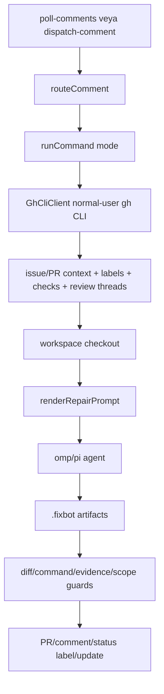

# Agent FixBot / Roboomp işletim dokümanı

Bu doküman `agent-fixbot`'un `@roboomp` gibi **normal bir GitHub kullanıcısı / machine user** olarak nasıl işletileceğini açıklar. Bu model GitHub App değildir: auth sınırı `gh` CLI + bot hesabı/PAT/SSH credential'dır; botun yaptığı GitHub mutasyonlarını wrapper yapar, ajan process'i GitHub token görmez.

Kaynak kapsamı: bu repo (`src/**`, `.fixbot.example.json`, `package.json`), `https://github.com/can1357/oh-my-pi/pull/4431`, `@roboomp` tarafından açılan PR'lar ve `@roboomp` tarafından yorumlanan issue/PR konuşmaları. Tam kabiliyet karşılaştırması için ayrıca bkz. `docs/roboomp-capability-audit.md`.

## Kısa sonuç

- Bu proje artık **normal GitHub kullanıcısı gibi çalışan lokal/hosted CLI runner** sağlar.
- Sürekli servis olmak zorunda değildir; `poll-issues` ve `poll-comments` komutları cron, systemd, launchd, GitHub Actions runner veya küçük bir daemon tarafından tekrar tekrar çağrılabilir.
- İş modeli: recent open issues poll edilip semantic label kuralları uygulanabilir; recent issue/PR comments poll edilir, `@bot` komutları route edilir, issue/PR context `gh` ile çekilir, workspace hazırlanır, `omp`/`pi` ajanı prompt dosyasıyla çalışır, guard'lar geçerse PR/comment/label/update yapılır.
- Varsayılan ajan komutu `omp -p @{prompt}`. `pi` için config'te command/args değiştirmek yeterlidir.
- Varsayılan güvenlik profili gerçek push'u kapatır: `policy.allowPush: false`. Gerçek PR için `.fixbot.json` içinde açıkça `true` yapılmalı.

## Normal GitHub kullanıcı modeli

Kurulum:

1. GitHub'da ayrı bot hesabı aç: örn. `roboomp`.
2. Repo/org içinde bu kullanıcıya gerekli yetkileri ver:
   - issue/PR okuma,
   - comment yazma/güncelleme,
   - label ekleme/silme,
   - branch push,
   - PR açma.
3. Host üzerinde bot hesabıyla `gh` login yap:

```bash
gh auth login --hostname github.com --git-protocol ssh --web --scopes repo
```

4. SSH key veya HTTPS credential store'u bot hesabına bağla.
5. Doğrula:

```bash
gh auth status
gh repo view owner/repo
gh issue view 123 --repo owner/repo
gh pr view 456 --repo owner/repo
```

Bu repo GitHub App installation token kullanmaz. Check Runs yazmaz; GitHub docs'a göre authenticated users/PAT check run oluşturamaz. CI görünürlüğü için PR comments, labels ve GitHub'ın mevcut check/run verilerini okuma kullanılır.

## Mimari



## Ana komutlar

```bash
pnpm install
pnpm build
node dist/cli.js doctor
```

Manual işler:

```bash
node dist/cli.js prepare owner/repo#123 --dry-run
node dist/cli.js reproduce owner/repo#123 --dry-run
node dist/cli.js triage owner/repo#123 --dry-run
node dist/cli.js review owner/repo#456 --dry-run
node dist/cli.js fix owner/repo#123 --dry-run
node dist/cli.js fix-ci owner/repo#456 --dry-run
node dist/cli.js address-review owner/repo#456 --dry-run
node dist/cli.js stop owner/repo#123
```

Yeni issue auto-label işi:

```bash
node dist/cli.js poll-issues owner/repo --dry-run
node dist/cli.js poll-issues owner/repo
```

Comment event işleri:

```bash
node dist/cli.js route-comment event.json --bot roboomp
node dist/cli.js dispatch-comment event.json --bot roboomp --dry-run
```

Normal-user polling işleri:

```bash
node dist/cli.js poll-issues owner/repo --dry-run
node dist/cli.js poll-comments owner/repo --bot roboomp --dry-run
```

`poll-comments` tek pass çalışır. Cron/daemon/systemd/launchd bunu periyodik çağırır. State JSON:

```json
{ "since": "2026-07-04T12:00:00Z" }
```

Not: `--dry-run` GitHub mutasyonlarını engeller ve nested commands'a `--dry-run` aktarır; poll state yazmaz. Böylece preview gerçek run'da yorumların atlanmasına yol açmaz.

Lokal sürekli runner:

```bash
pnpm dev -- owner/repo --bot roboomp --dry-run
pnpm start -- owner/repo --bot roboomp
```

`pnpm dev` önce build alır, sonra `daemon` komutunu çalıştırır. `pnpm start` mevcut `dist/` çıktısını kullanır. Daemon tek process içinde `poll-comments` ve `poll-issues` pass'lerini sırayla bekleyerek çalıştırır; aynı process içinde overlap yapmaz. Varsayılan interval'ler:

```bash
node dist/cli.js daemon owner/repo --bot roboomp --comments-interval 60 --issues-interval 180
```

`Ctrl+C` veya `SIGTERM` ile durur. Yerel geliştirmede önce `--dry-run` kullan; gerçek comment/label/agent dispatch için dry-run'ı kaldır.

## Desteklenen yorumlar

- `@roboomp fix`
- `@roboomp fix ci`
- `@roboomp address review`
- `@roboomp Resolve codex reviews`
- `@roboomp triage`
- `@roboomp review`
- `@roboomp stop`

Router kuralları:

- Mention case-insensitive'dir.
- `address review`, plain `review` üstünde önceliklidir.
- `stop`, plain `review` üstünde önceliklidir.
- Word-boundary guard vardır: `previews`, `reviewed`, `triaged` komut sayılmaz.

## Mode sözleşmeleri

| Mode | Artifact | Source edit? | Publish sonucu |
|---|---|---|---|
| `prepare` | `.fixbot/job.json`, `.fixbot/prompt.md` | Hayır | Sadece dosya yolları. |
| `reproduce` | `.fixbot/reproduction.json` | Sadece test/fixture/.fixbot | Repro report, status comment, label. |
| `triage` | `.fixbot/triage.md` | Hayır | Issue comment, status update, label. |
| `review` | `.fixbot/review.md` | Hayır, read-only | PR/issue comment, status update, label. |
| `fix` | `.fixbot/result.md` + opsiyonel `.fixbot/evidence.json` | Evet | Yeni PR veya existing bot PR continuation. |
| `fix-ci` | `.fixbot/result.md` + `.fixbot/evidence.json` | Evet | Failing CI/check düzeltmesi için PR/update. |
| `address-review` | `.fixbot/result.md` + opsiyonel `.fixbot/resolved-review-threads.json` | Evet | Mevcut PR branch'ine commit/push; thread resolve best-effort. |
| `stop` | Yok | Yok | Aynı hosttaki kayıtlı child PID'e `SIGTERM`. |

## GitHub context kapsamı

`GhCliClient` normal kullanıcı `gh` CLI ile şunları okur/yazar:

- Issue body/comments/labels.
- Recent open issues listesi (`GET /repos/{owner}/{repo}/issues`); PR-shaped issue kayıtları atlanır.
- PR body/comments/reviews/inline comments/commits/changed files/diff.
- PR `headRefName`, `headRefOid`, head repository.
- Check runs/read-only CI detail summary (`GET /repos/{owner}/{repo}/commits/{sha}/check-runs`).
- Review threads GraphQL query.
- Issue comment create/update (`POST` / `PATCH issues/comments`).
- Issue labels add/remove (`POST issues/{number}/labels`, `DELETE issues/{number}/labels/{name}`).
- Review thread resolve GraphQL mutation, sadece normal kullanıcının yetkisi varsa.

Check Run create yok; GitHub Apps'e özel olduğu için bu machine-user modelinde kullanılmaz.

## Existing PR continuation

`findOpenBotPrForIssue` yalnızca güvenli eşleşmeyi kabul eder:

- PR bot-authored olmalı veya branch `fixbot/issue-<N>` / `fixbot/issue-<N>-...` olmalı.
- Issue marker digit-boundary ile eşleşir; `#12`, `#123` ile karışmaz.
- İnsan PR'ı sadece body'de `#N` geçtiği için seçilmez.

Existing bot PR bulunursa `gh pr checkout` ile aynı branch'e devam edilir ve push ref `HEAD:<existing-head-ref>` olur.

## Job lock ve stop

- Her job için `.fixbot/locks/<owner-repo>/<number>.json` lock alınır.
- Aynı `repo#number` için ikinci job `Job already running for owner/repo#N.` döndürür, agent çalıştırmaz.
- Lock job bitince release edilir; dry-run da lock alır/release eder.
- Running child PID `.fixbot/running/...` altında tutulur; `stop` aynı hosttaki PID'i `SIGTERM` ile durdurur.

## Issue auto-label lifecycle

`poll-issues` yeni/güncellenmiş açık issue'ları okur, PR kayıtlarını `pull_request` alanından filtreler ve `autoLabel` kurallarına göre eksik semantic label'ları ekler. Opsiyonel `autoDispatch` açıksa aynı geçişte mevcut modlardan birini (`triage`, `reproduce`, `fix`) otomatik başlatabilir.

- State dosyası varsayılan: `.fixbot/issue-state/<owner-repo>.json`.
- `--dry-run` issue'ları okur ve ne yapacağını yazar; label mutasyonu, agent dispatch ve state write yapmaz.
- Non-dry modda yalnız eksik label'lar eklenir; mevcut label tekrar eklenmez.
- `autoDispatch.enabled:false` varsayılandır; agent maliyeti/yan etkisi açık opt-in ister.
- `autoDispatch.maxPerPoll`, `skipWhenLabels` ve `requireLabels` gürültülü issue update'lerinin paralel/pahalı job doğurmasını sınırlar.
- Otomatik başlatılan job mevcut per-issue lock'u kullanır; aynı issue için paralel agent çalışmaz.
- Wrapper started status'ı idempotent marker/upsert ile yazar; human opening/progress tonunu agent prompt'u kendi artifact/comment içeriğinde üretir.
- Varsayılan `defaultLabels: []`; label bulunmayan issue'ya repo'da var olmayan `needs-triage` gibi label basıp job'ı bozmaz. Default label isteniyorsa repo label'ı önceden oluşturulup config'e eklenmeli.
- Bu semantic label sistemi `policy.statusLabels` değildir; status label'ları job lifecycle içindir.

## Status comment lifecycle ve labels

`postStatusComment` artık status marker ile upsert yapar:

```html
<!-- agent-fixbot:status:started -->
```

Aynı status tekrar yazılırsa yeni comment spam'i yerine mevcut comment PATCH edilir. Config'teki `policy.statusLabels` değerleri varsa live modda önce diğer status label'ları kaldırılır, sonra güncel status label'ı eklenir; böylece `fixbot:running` + `fixbot:blocked` gibi çelişkili label birikmez.

## Evidence, scope ve live-service guard

Agent kaynak değişikliği yaptığında `.fixbot/evidence.json` yazabilir:

```json
{
  "tests": [
    { "command": "pnpm test", "status": "passed" }
  ],
  "changelog": ["packages/foo/CHANGELOG.md"],
  "liveServices": [
    { "service": "provider-api", "status": "passed" }
  ],
  "scope": { "status": "passed" }
}
```

Policy alanları:

- `requireTestEvidence`
- `requireChangelog`
- `requireLiveServiceEvidence`
- `allowLiveServices`

Guard sonuçları:

- Test evidence required.
- Passing test evidence required.
- Changelog evidence required.
- Live service evidence is not allowed.
- Live service evidence required.
- Passing live service evidence required.
- Semantic scope evidence failed.

`allowLiveServices:false` iken `.fixbot/evidence.json` içinde herhangi bir `liveServices` kaydı publish'i bloklar.

## Prepublish command gate

Agent publish öncesi `.fixbot/prepublish.json` yazabilir:

```json
{
  "commands": [
    { "command": "pnpm", "args": ["test"], "description": "focused regression suite" }
  ]
}
```

Kurallar:

- Render edilmiş command exact olarak `policy.allowedCommands` içinde olmalı.
- İzinsiz komut çalıştırılmaz.
- İzinli komut non-zero dönerse publish bloklanır.
- Dosya yoksa gate pass.

## `.fixbot.json` örneği

```json
{
  "defaultBase": "main",
  "botName": "roboomp",
  "workspaceRoot": ".workspaces",
  "agent": {
    "command": "omp",
    "args": ["-p", "@{prompt}"],
    "timeoutSeconds": 2700
  },
  "git": {
    "authorName": "roboomp",
    "authorEmail": "roboomp@users.noreply.github.com"
  },
  "autoLabel": {
    "enabled": true,
    "defaultLabels": [],
    "rules": [
      { "label": "bug", "keywords": ["bug", "crash", "error", "exception", "regression", "broken", "fail"] },
      { "label": "documentation", "keywords": ["docs", "documentation", "readme"] },
      { "label": "enhancement", "keywords": ["feature", "enhancement", "improve", "request"] },
      { "label": "question", "keywords": ["question", "how do i", "how to", "help"] }
    ]
  },
  "autoDispatch": {
    "enabled": false,
    "mode": "triage",
    "maxPerPoll": 1,
    "skipWhenLabels": ["triaged"],
    "requireLabels": []
  },
  "policy": {
    "requireHumanReview": true,
    "allowLiveServices": false,
    "allowPush": false,
    "maxChangedFiles": 20,
    "maxDiffLines": 1200,
    "blockedPaths": [".github/workflows/**", "scripts/release/**", "**/.env*"],
    "allowedCommands": ["pnpm test", "pnpm typecheck", "pnpm build", "bun test", "npm test"],
    "requireTestEvidence": false,
    "requireChangelog": false,
    "requireLiveServiceEvidence": false,
    "statusLabels": {
      "started": "fixbot:running",
      "blocked": "fixbot:blocked",
      "reproduced": "fixbot:reproduced",
      "no-repro": "fixbot:no-repro",
      "pr-opened": "fixbot:pr-opened",
      "review-addressed": "fixbot:review-addressed",
      "triaged": "triaged",
      "reviewed": "reviewed"
    }
  }
}
```

Gerçek PR için:

```json
{
  "policy": {
    "allowPush": true,
    "requireTestEvidence": true
  }
}
```

`git.authorName` ve `git.authorEmail` sadece botun publish sırasında attığı PR commit'leri için kullanılır. Lokal maintainer commit'leri repo `git config user.name/user.email` değerlerini kullanmaya devam eder; böylece `byigitt` commit'leri ve `roboomp`/bot commit'leri ayrılır.

## OMP / Pi bağlama

OMP varsayılanı:

```json
{
  "agent": {
    "command": "omp",
    "args": ["-p", "@{prompt}"],
    "timeoutSeconds": 2700
  }
}
```

Pi prompt dosyası kabul ediyorsa:

```json
{
  "agent": {
    "command": "pi",
    "args": ["-p", "@{prompt}"],
    "timeoutSeconds": 2700
  }
}
```

Pi farklı input istiyorsa wrapper script kullan:

```json
{
  "agent": {
    "command": "./scripts/run-pi-agent",
    "args": ["{prompt}"],
    "timeoutSeconds": 2700
  }
}
```

Wrapper GitHub token export etmemeli; GitHub mutasyonları `agent-fixbot` tarafında kalmalı.

## Production checklist

- [ ] Ayrı bot GitHub kullanıcısı açıldı.
- [ ] Bot kullanıcı repo/org yetkilerine sahip.
- [ ] Hostta `gh auth status` bot hesabını gösteriyor.
- [ ] `.fixbot.json` botName, agent command ve policy değerleri set.
- [ ] `node dist/cli.js doctor` geçiyor.
- [ ] `prepare --dry-run`, `triage --dry-run`, `review --dry-run`, `fix --dry-run` geçiyor.
- [ ] `poll-issues --dry-run` beklenen semantic label ve auto-dispatch kararlarını gösteriyor ama label/state/agent çalıştırmıyor.
- [ ] `poll-comments --dry-run` beklenen komutları gösteriyor ama state yazmıyor.
- [ ] Non-dry `poll-issues` ve `poll-comments` için state dosyaları kalıcı diskte.
- [ ] `.workspaces`, `.fixbot/locks`, `.fixbot/running`, `.fixbot/issue-state`, `.fixbot/poll-state` kalıcı ve cleanup politikası belirli.
- [ ] İlk gerçek run küçük, düşük riskli issue üzerinde yapıldı.
